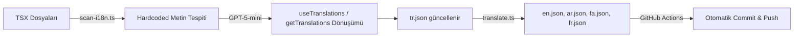

# AI-Powered i18n Automation System for Next.js

> **Purpose:** Bu doküman, Next.js projelerinde AI destekli otomatik çeviri sistemi kurulumunu adım adım anlatır. Herhangi bir Next.js projesine uyarlanabilir.

---

## Mimari Genel Bakış



## Kullanılan Teknolojiler

| Teknoloji | Amaç |
|-----------|-------|
| **next-intl** | i18n kütüphanesi (App Router uyumlu) |
| **GPT-5-mini** | AI çeviri + kod dönüşüm motoru |
| **GitHub Actions** | Nightly otomatik pipeline |
| **TypeScript (tsx)** | Script dili |

---

## 1. next-intl Kurulumu

### 1.1 Paket Kurulumu
```bash
npm install next-intl
```

### 1.2 Dosya Yapısı
```
src/
├── i18n/
│   ├── routing.ts          # Locale listesi + default locale
│   └── request.ts          # next-intl server config
├── messages/
│   ├── tr.json             # Kaynak dil (Türkçe)
│   ├── en.json             # AI tarafından üretilir
│   ├── ar.json             # AI tarafından üretilir
│   ├── fa.json             # AI tarafından üretilir
│   ├── fr.json             # AI tarafından üretilir
│   └── _meta.json          # Delta hash tracking
├── proxy.ts                # Middleware (locale detection)
└── app/
    └── [locale]/           # Tüm sayfalar locale prefix altında
        ├── layout.tsx      # NextIntlClientProvider
        └── page.tsx
```

### 1.3 routing.ts
```typescript
import { defineRouting } from "next-intl/routing";

export const routing = defineRouting({
  locales: ["tr", "en", "ar", "fa", "fr"],
  defaultLocale: "tr",
});

export type Locale = (typeof routing.locales)[number];
```

### 1.4 request.ts
```typescript
import { getRequestConfig } from "next-intl/server";
import { routing } from "./routing";

export default getRequestConfig(async ({ requestLocale }) => {
  let locale = await requestLocale;
  if (!locale || !routing.locales.includes(locale as any)) {
    locale = routing.defaultLocale;
  }
  return {
    locale,
    messages: (await import(`../messages/${locale}.json`)).default,
  };
});
```

### 1.5 next.config.ts
```typescript
import createNextIntlPlugin from "next-intl/plugin";
const withNextIntl = createNextIntlPlugin("./src/i18n/request.ts");
export default withNextIntl(nextConfig);
```

### 1.6 [locale]/layout.tsx
```tsx
import { NextIntlClientProvider } from "next-intl";
import { getMessages } from "next-intl/server";

export default async function LocaleLayout({ children, params }) {
  const { locale } = await params;
  const messages = await getMessages();
  return (
    <html lang={locale} dir={locale === "ar" || locale === "fa" ? "rtl" : "ltr"}>
      <body>
        <NextIntlClientProvider messages={messages}>
          {children}
        </NextIntlClientProvider>
      </body>
    </html>
  );
}
```

---

## 2. Çeviri Stratejisi: Server vs Client

> [!IMPORTANT]
> Next.js App Router'da **server component** ve **client component** farklı çeviri API'leri kullanır.

### Client Component (bileşenler, interaktif sayfalar)
```tsx
"use client";
import { useTranslations } from "next-intl";

export function MyComponent() {
  const t = useTranslations("myComponent");
  return <h1>{t("title")}</h1>;
}
```

### Server Component (page.tsx, metadata)
```tsx
import { getTranslations } from "next-intl/server";

export default async function MyPage() {
  const t = await getTranslations("myPage");
  return <h1>{t("title")}</h1>;
}

export async function generateMetadata() {
  const t = await getTranslations("myPage");
  return { title: t("metaTitle") };
}
```

### Karar Kuralı
- Dosyada `useState`, `useEffect`, `onClick` varsa → **Client Component** → `useTranslations`
- Dosyada `export const metadata` veya `generateMetadata` varsa → **Server Component** → `getTranslations`
- page.tsx dosyaları **varsayılan olarak** server component'tır

---

## 3. Script 1: scan-i18n.ts (Otomatik Tarama + Dönüşüm)

### Çalışma Prensibi
1. `src/` altındaki tüm `.tsx` dosyalarını tarar
2. Zaten `useTranslations` veya `getTranslations` kullananları **atlar**
3. Türkçe karakter (`Ç窺ĞğÜüÖöİı`) içerenleri filtreler
4. Her dosyayı GPT-5-mini'ye gönderir
5. AI iki şey üretir:
   - `translationKeys`: çeviri key-value çiftleri (tr.json'a eklenir)
   - `updatedCode`: dosyanın `useTranslations`/`getTranslations` ile yeniden yazılmış hali
6. Sonuçları diske yazar

### AI Prompt Stratejisi
İki ayrı prompt kullanılır:

**CLIENT_COMPONENT_PROMPT:**
- `"use client"` ekler
- `useTranslations` hook'u kullanır
- Namespace: component adından türetilir (PascalCase → camelCase)

**SERVER_COMPONENT_PROMPT:**
- `"use client"` EKLEMEZ
- `getTranslations` kullanır (async/await ile)
- `export const metadata` → `export async function generateMetadata()` dönüştürür
- Namespace: dizin adından türetilir (`kvkk/page.tsx` → `kvkkPage`)

### Namespace Mantığı
```
Component dosyaları:     AboutSection.tsx    → "aboutSection"
page.tsx dosyaları:      kvkk/page.tsx       → "kvkkPage"
Nested page.tsx:         blog/[slug]/page.tsx → "blogDetailPage"
Root page.tsx:           [locale]/page.tsx    → "homePage"
```

### Komutlar
```bash
npm run scan-i18n          # Dry-run: sadece rapor
npm run scan-i18n:apply    # Tarama + dönüşüm uygula
```

---

## 4. Script 2: translate.ts (Delta Çeviri)

### Çalışma Prensibi
1. `tr.json`'daki tüm key'leri hash'ler (MD5)
2. `_meta.json`'daki önceki hash'lerle karşılaştırır
3. Sadece **değişen key'leri** GPT-5-mini'ye gönderir
4. Çevirilen key'leri hedef dil dosyalarına merge eder
5. Kaynak dosyada artık olmayan key'leri siler

### Delta Tracking (_meta.json)
```json
{
  "hashes": {
    "hero.badge": "a1b2c3d4",
    "hero.title": "e5f6g7h8"
  },
  "lastRun": "2026-03-11T14:00:00.000Z"
}
```

### Maliyet Optimizasyonu
- `--force` olmadan: sadece değişen key'ler çevrilir (ucuz)
- `--force` ile: tüm key'ler yeniden çevrilir (tam güncelleme)

### Komutlar
```bash
npm run translate          # Delta çeviri (sadece değişenler)
npm run translate:force    # Tüm key'leri yeniden çevir
```

---

## 5. GitHub Actions Pipeline

### Workflow Dosyası (.github/workflows/translate.yml)
```yaml
name: Auto Translate
on:
  schedule:
    - cron: "0 0 * * *"    # Her gece 00:00 UTC
  workflow_dispatch:        # Manuel tetikleme
    inputs:
      force:
        description: "Tüm key'leri yeniden çevir"
        type: boolean
        default: false

jobs:
  translate:
    runs-on: ubuntu-latest
    permissions:
      contents: write
    steps:
      - uses: actions/checkout@v5
      - uses: actions/setup-node@v5
        with:
          node-version: "22"
          cache: "npm"
      - run: npm ci

      - name: Scan & convert hardcoded strings
        env:
          OPENAI_API_KEY: ${{ secrets.OPENAI_API_KEY }}
        run: npx tsx scripts/scan-i18n.ts --apply

      - name: Run translation
        env:
          OPENAI_API_KEY: ${{ secrets.OPENAI_API_KEY }}
        run: npx tsx scripts/translate.ts

      - name: Check for changes
        id: changes
        run: git diff --quiet src/ || echo "changed=true" >> $GITHUB_OUTPUT

      - name: Commit & Push
        if: steps.changes.outputs.changed == 'true'
        run: |
          git config user.name "github-actions[bot]"
          git config user.email "github-actions[bot]@users.noreply.github.com"
          git add src/
          git commit -m "chore(i18n): auto-scan and translate"
          git push
```

### Gerekli GitHub Secret
- `OPENAI_API_KEY`: OpenAI API anahtarı (Settings → Secrets → Actions)

---

## 6. Yeni Projeye Uygulama Adımları

### Hızlı Kurulum Checklist
1. `npm install next-intl` kur
2. `src/i18n/routing.ts` ve `src/i18n/request.ts` oluştur
3. `next.config.ts`'e `createNextIntlPlugin` ekle
4. `src/app/[locale]/layout.tsx` oluştur (NextIntlClientProvider)
5. Mevcut sayfaları `src/app/[locale]/` altına taşı
6. `src/messages/tr.json` oluştur (boş `{}` ile başla)
7. `scripts/scan-i18n.ts` kopyala ve projeye uyarla
8. `scripts/translate.ts` kopyala
9. `package.json`'a script komutlarını ekle
10. `npm run scan-i18n:apply` çalıştır → AI tüm bileşenleri dönüştürür
11. `npm run translate` çalıştır → 4 dile çevirir
12. `.github/workflows/translate.yml` ekle
13. GitHub'a `OPENAI_API_KEY` secret ekle

### Projeye Göre Uyarlanacaklar
- `routing.ts`'deki locale listesi
- `translate.ts`'deki `SYSTEM_PROMPT` (şirket bağlamı)
- `scan-i18n.ts`'deki `SKIP_PATTERNS` (atlanacak dosyalar)
- `scan-i18n.ts`'deki Türkçe karakter regex'i (kaynak dile göre değiştir)

---

## 7. Önemli Notlar

> [!WARNING]
> - AI bazen server/client ayrımını karıştırabilir — `build` testini **her zaman** çalıştır
> - `useState`/`useEffect` olan dosyalar **client component** olmalı
> - `export const metadata` olan dosyalar **server component** olmalı

> [!TIP]
> - Maliyet: GPT-5-mini ile 600 key × 4 dil ≈ $0.50
> - Delta çeviri ile günlük maliyet: ~$0.01-0.05
> - `--force` modu sadece büyük güncellemelerde kullan
