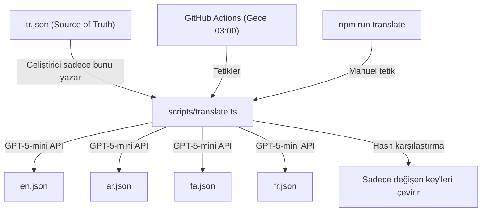

# Çok Dilli Site: Otomatik AI Çeviri Sistemi + i18n Altyapısı

## Mimari Özet

### Çalışma Prensibi
1. **Tek kaynak**: Geliştirici sadece `tr.json`'u düzenler
2. **Delta algılama**: Script, `tr.json`'daki her key'in hash'ini `_meta.json`'da saklar. Sadece **yeni/değişen** key'leri çevirir (maliyet optimizasyonu)
3. **GPT-5-mini**: Eğitim danışmanlığı bağlamında kaliteli çeviri üretir
4. **2 tetikleme yolu**:
   - `npm run translate` → terminalden manuel
   - GitHub Actions → her gece 03:00'te otomatik (+ push'ta da tetiklenir)

---

## Proposed Changes

### Bileşen 1: Çeviri Script'i

#### [NEW] [translate.ts](file:///Users/kent/Applications/atasaedu.com/scripts/translate.ts)
- `tr.json` okur → hedef locale dosyalarıyla karşılaştırır
- Eksik/değişen key'leri tespit eder
- GPT-5-mini'ye bağlam bilgisi ile gönderir
- Sonucu `{locale}.json`'a yazar
- `_meta.json`'a hash'leri kaydeder

#### [NEW] [_meta.json](file:///Users/kent/Applications/atasaedu.com/src/messages/_meta.json)
- Her key'in son çevrilmiş hash değerini tutar
- Delta çeviri için referans

---

### Bileşen 2: GitHub Actions Workflow

#### [NEW] [translate.yml](file:///Users/kent/Applications/atasaedu.com/.github/workflows/translate.yml)
- **Cron**: Her gece 03:00 UTC+3 (00:00 UTC)
- **Manuel tetik**: `workflow_dispatch` ile GitHub'dan da tetiklenebilir
- **Secrets**: `OPENAI_API_KEY` (repository secret)
- **Akış**: checkout → Node.js setup → npm install → `npm run translate` → git commit & push

---

### Bileşen 3: npm Script

#### [MODIFY] [package.json](file:///Users/kent/Applications/atasaedu.com/package.json)
- `"translate": "npx tsx scripts/translate.ts"` script'i eklenir

---

### Bileşen 4: i18n Altyapısı (Zaten Oluşturuldu)

| Dosya | Durum |
|-------|-------|
| `src/i18n/routing.ts` | ✅ Oluşturuldu |
| `src/i18n/request.ts` | ✅ Oluşturuldu |
| `src/middleware.ts` | ✅ Oluşturuldu |
| `src/messages/tr.json` | ✅ Oluşturuldu |
| `next-intl` paketi | ✅ Kuruldu |

---

### Bileşen 5: App Router Dönüşümü (Sonraki Adım)

i18n altyapısı + çeviri sistemi hazır olduktan sonra:
- Tüm sayfalar `[locale]` segment altına taşınacak
- Bileşenler `useTranslations()` hook'u kullanacak
- Language Switcher UI eklenecek
- SEO optimizasyonu (hreflang, sitemap, robots)

---

## User Review Required

> [!IMPORTANT]
> **GitHub repository secret**: `OPENAI_API_KEY` GitHub repo settings'te secret olarak eklenmeli. Bunu sen mi ekleyeceksin yoksa benim GitHub MCP ile eklememi ister misin?

> [!NOTE]
> **Maliyet tahmini**: GPT-5-mini ile ~50 key × 4 dil = ~200 çeviri isteği/gün. Tahmini gece başına < $0.05 (sadece delta çevrildiğinde çok daha az).

---

## Verification Plan

### Otomatik
- `npm run translate` çalıştırılır → `en.json`, `ar.json`, `fa.json`, `fr.json` dosyaları oluşur
- Oluşan dosyalar valid JSON olmalı, tüm key'leri `tr.json` ile eşleşmeli

### Manuel
- GitHub Actions workflow'un doğru çalıştığının kontrolü
- Çeviri kalitesinin spot check'i
