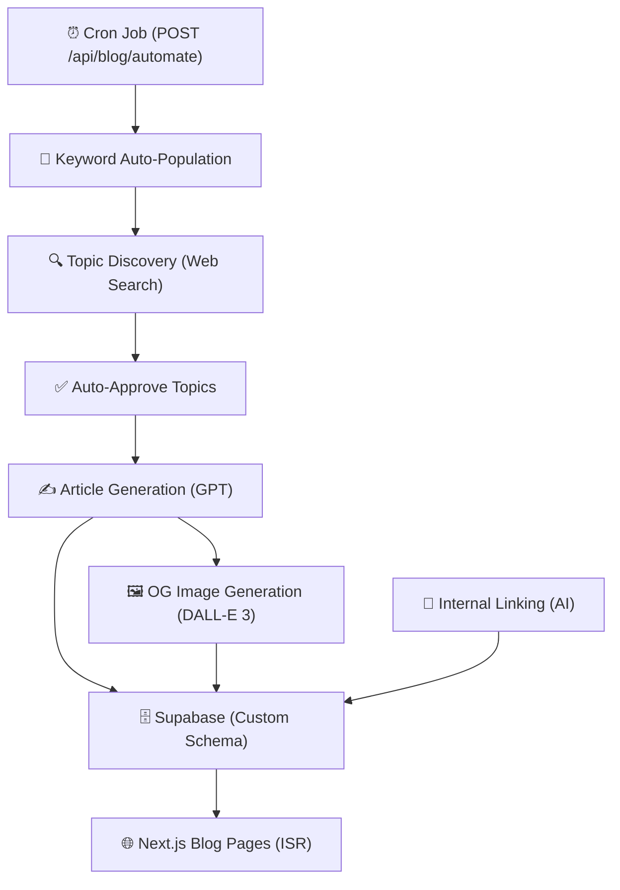
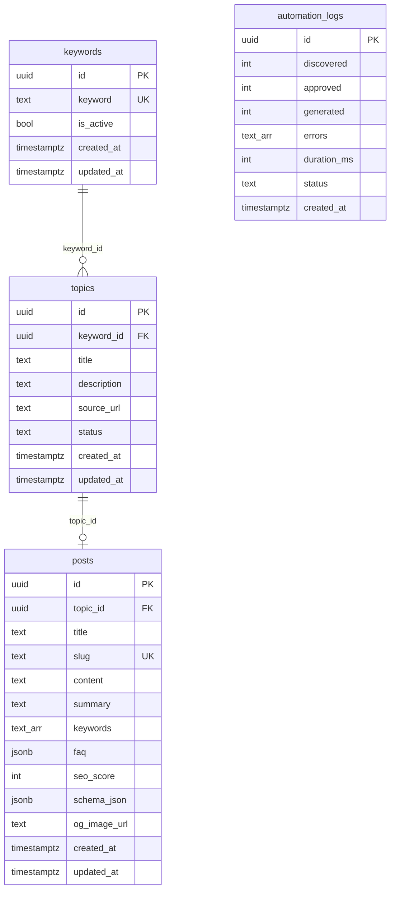

# 🤖 AI Blog Sistemi — Tam Dokümantasyon

> **Tech Stack:** Next.js (App Router) + Supabase (Custom Schema) + OpenAI GPT + DALL-E 3
> **Amaç:** Anahtar kelimelerden otomatik topic keşfi, makale üretimi, OG görsel oluşturma ve internal linking ile tam otonom blog pipeline'ı.

---

## 📐 Mimari Genel Bakış



### Pipeline Akışı

| Adım | Açıklama | Servis |
|------|----------|--------|
| 0 | Aktif keyword sayısı düşükse AI ile yeni keyword üret | `autoPopulateKeywords()` |
| 1 | Her keyword için web araştırması yap, topic keşfet | `discoverTopics()` |
| 2 | Keşfedilen topic'leri otomatik onayla | `autoApproveTopics()` |
| 3 | Onaylanan topic'lerden makale üret | `generateArticle()` |
| 4 | DALL-E 3 ile OG görseli üret, Storage'a yükle | `generateOGImage()` |
| 5 | Mevcut makaleler arası internal link ekle | `runInternalLinking()` |

---

## 📁 Dosya Yapısı

```
src/
├── app/
│   ├── api/blog/
│   │   ├── automate/route.ts      # Cron endpoint — tam pipeline
│   │   ├── discover/route.ts      # Manuel topic keşfi
│   │   ├── generate/route.ts      # Manuel makale üretimi
│   │   ├── keywords/route.ts      # CRUD — keyword yönetimi
│   │   ├── topics/route.ts        # Topic listeleme ve durum güncelleme
│   │   ├── posts/route.ts         # Post listeleme (paginated)
│   │   ├── posts/[slug]/route.ts  # Tekil post by slug
│   │   └── internal-link/route.ts # Manuel internal linking
│   │
│   └── blog/
│       ├── page.tsx               # Blog listing (Server Component + ISR)
│       ├── BlogListingClient.tsx   # Listing UI (Client Component)
│       ├── [slug]/page.tsx        # Blog detail (Server Component)
│       ├── [slug]/BlogDetailClient.tsx # Detail UI (Client Component)
│       └── blog-theme.css         # Blog-specific tema değişkenleri
│
├── lib/blog/
│   ├── supabaseAdmin.ts           # Supabase client (Custom Schema)
│   ├── blogService.ts             # CRUD operasyonları — keyword, topic, post
│   ├── keywordDiscovery.ts        # AI keyword üretimi + topic keşfi
│   ├── seoOptimizer.ts            # AI makale üretimi + SEO
│   ├── internalLinker.ts          # AI internal linking
│   ├── aiSeoSchema.ts             # Schema.org JSON-LD üreticileri
│   └── ogImageGenerator.ts        # DALL-E 3 OG görsel üretici
│
└── features/blog/
    ├── index.ts                   # Barrel export
    ├── types/index.ts             # BlogPost, BlogPostCard, FaqItem vb.
    └── components/
        ├── BlogCard.tsx           # Kart bileşeni (featured + normal)
        ├── BlogFAQ.tsx            # FAQ accordion bileşeni
        ├── TableOfContents.tsx    # İçindekiler navigasyonu
        └── ShareButtons.tsx       # Sosyal paylaşım butonları
```

---

## 🗄️ Veritabanı Şeması (Supabase)

> [!IMPORTANT]
> Client `atasa_kurumsal` adında **custom schema** kullanıyor. Yeni projede kendi schema adınızı belirleyin.

### SQL Migration

```sql
-- ═══════════════════════════════════════════════
-- Schema oluştur (public yerine custom schema)
-- ═══════════════════════════════════════════════
CREATE SCHEMA IF NOT EXISTS your_schema_name;

-- ═══════════════════════════════════════════════
-- Keywords tablosu
-- ═══════════════════════════════════════════════
CREATE TABLE your_schema_name.keywords (
    id UUID DEFAULT gen_random_uuid() PRIMARY KEY,
    keyword TEXT NOT NULL UNIQUE,
    is_active BOOLEAN DEFAULT true,
    created_at TIMESTAMPTZ DEFAULT now(),
    updated_at TIMESTAMPTZ DEFAULT now()
);

-- ═══════════════════════════════════════════════
-- Topics tablosu
-- ═══════════════════════════════════════════════
CREATE TABLE your_schema_name.topics (
    id UUID DEFAULT gen_random_uuid() PRIMARY KEY,
    keyword_id UUID REFERENCES your_schema_name.keywords(id) ON DELETE CASCADE,
    title TEXT NOT NULL,
    description TEXT,
    source_url TEXT,
    status TEXT DEFAULT 'discovered'
        CHECK (status IN ('discovered', 'approved', 'generating', 'published', 'rejected', 'failed')),
    created_at TIMESTAMPTZ DEFAULT now(),
    updated_at TIMESTAMPTZ DEFAULT now()
);

-- ═══════════════════════════════════════════════
-- Posts tablosu
-- ═══════════════════════════════════════════════
CREATE TABLE your_schema_name.posts (
    id UUID DEFAULT gen_random_uuid() PRIMARY KEY,
    topic_id UUID REFERENCES your_schema_name.topics(id) ON DELETE SET NULL,
    title TEXT NOT NULL,
    slug TEXT NOT NULL UNIQUE,
    content TEXT NOT NULL,
    summary TEXT,
    keywords TEXT[] DEFAULT '{}',
    faq JSONB DEFAULT '[]',
    seo_score INTEGER DEFAULT 0,
    schema_json JSONB DEFAULT '{}',
    og_image_url TEXT,
    created_at TIMESTAMPTZ DEFAULT now(),
    updated_at TIMESTAMPTZ DEFAULT now()
);

-- ═══════════════════════════════════════════════
-- Automation Logs tablosu
-- ═══════════════════════════════════════════════
CREATE TABLE your_schema_name.automation_logs (
    id UUID DEFAULT gen_random_uuid() PRIMARY KEY,
    discovered INTEGER DEFAULT 0,
    approved INTEGER DEFAULT 0,
    generated INTEGER DEFAULT 0,
    errors TEXT[] DEFAULT '{}',
    duration_ms INTEGER DEFAULT 0,
    status TEXT DEFAULT 'success'
        CHECK (status IN ('success', 'partial', 'failed')),
    created_at TIMESTAMPTZ DEFAULT now()
);

-- ═══════════════════════════════════════════════
-- İndeksler
-- ═══════════════════════════════════════════════
CREATE INDEX idx_topics_status ON your_schema_name.topics(status);
CREATE INDEX idx_topics_keyword_id ON your_schema_name.topics(keyword_id);
CREATE INDEX idx_posts_slug ON your_schema_name.posts(slug);
CREATE INDEX idx_posts_created_at ON your_schema_name.posts(created_at DESC);
```

### Tablo İlişkileri



---

## ⚙️ Environment Variables

```env
# Supabase
NEXT_PUBLIC_SUPABASE_URL=https://xxxxx.supabase.co
NEXT_PUBLIC_SUPABASE_ANON_KEY=eyJ...       # Public key (client-side)
SUPABASE_SERVICE_ROLE_KEY=eyJ...            # Server-side (admin erişim)

# OpenAI
OPENAI_API_KEY=sk-...

# Cron güvenliği
CRON_SECRET=rastgele-guclu-bir-secret

# Opsiyonel
PORT=3000
```

---

## 🔌 Supabase Client (Custom Schema)

```typescript
// src/lib/blog/supabaseAdmin.ts
import { createClient } from '@supabase/supabase-js';

let _client: any = null;

export function getSupabaseAdmin() {
    if (!_client) {
        const supabaseUrl = process.env.NEXT_PUBLIC_SUPABASE_URL;
        const supabaseServiceKey = process.env.SUPABASE_SERVICE_ROLE_KEY;

        if (!supabaseUrl || !supabaseServiceKey) {
            throw new Error('NEXT_PUBLIC_SUPABASE_URL ve SUPABASE_SERVICE_ROLE_KEY gerekli');
        }

        _client = createClient(supabaseUrl, supabaseServiceKey, {
            db: { schema: 'your_schema_name' }, // ← CUSTOM SCHEMA
        });
    }
    return _client;
}
```

> [!CAUTION]
> Custom schema kullanırken Supabase Dashboard'da **API Settings → Exposed Schemas** kısmına schema adını eklemeyi unutmayın! Aksi halde sorgular boş döner.

---

## 🔑 Servis Katmanı — blogService.ts

Tüm veritabanı CRUD işlemlerini tek dosyada toplar.

### Fonksiyonlar

| Fonksiyon | Açıklama |
|-----------|----------|
| `getKeywords()` | Tüm keyword'leri listele |
| `addKeyword(keyword)` | Yeni keyword ekle |
| `updateKeyword(id, updates)` | Keyword güncelle |
| `deleteKeyword(id)` | Keyword sil |
| `getTopics(status?)` | Topic'leri listele (opsiyonel status filtre) |
| `updateTopicStatus(id, status)` | Topic durumunu güncelle |
| `createTopic(topic)` | Yeni topic oluştur |
| `getTopicsByKeywordId(keywordId)` | Bir keyword'ün topic'lerini getir |
| `getPosts(page, limit)` | Post'ları paginated listele |
| `getPostBySlug(slug)` | Tekil post getir |
| `createPost(post)` | Yeni post oluştur |
| `autoApproveTopics(limit)` | Discovered → Approved toplu güncelle |
| `getTodayGenerationCount()` | Bugün üretilen makale sayısını getir |
| `logAutomationRun(log)` | Otomasyon sonucunu logla |

### Topic Status Flow

```
discovered → approved → generating → published
                ↓                        ↓
            rejected                  failed
```

---

## 🔍 Keyword Discovery — keywordDiscovery.ts

### `discoverTopics()`

Her aktif keyword için OpenAI web search ile topic keşfeder.

**Akış:**
1. Aktif keyword'leri çek
2. Her keyword için `searchWebForKeyword()` çağır
3. Daha önce kaydedilmiş URL/title ile çakışmaları filtrele
4. `relevance_score >= 50` olan topic'leri kaydet

**AI Prompt Stratejisi:**
- 4 kategori: `news` | `evergreen` | `paa` | `long-tail`
- Skor sistemi: Alakalılık (0-40) + Arama Potansiyeli (0-30) + Düşük Rekabet (0-30)
- Her keyword için 8-12 topic üretilir

### `autoPopulateKeywords(minThreshold)`

Aktif keyword sayısı düşükse AI ile yeni long-tail keyword üretir.

```typescript
// Eğer aktif keyword < 5 ise otomatik 5 yeni keyword üret
const populated = await autoPopulateKeywords(5);
```

> [!TIP]
> AI prompt'unu projenize göre düzenleyin. Prompt'taki hizmet listesi ve örnek keyword'ler sizin sektörünüze uygun olmalı.

---

## ✍️ AI Makale Üretimi — seoOptimizer.ts

### `generateArticle(topic)`

Onaylanan topic'ten tam SEO uyumlu makale üretir.

**Üretilen İçerik:**

| Alan | Detay |
|------|-------|
| `title` | 50-60 karakter, ana keyword içerir |
| `slug` | URL-friendly, Türkçe karakter dönüşümü (ç→c, ş→s vb.) |
| `content` | HTML formatında, H2/H3 hiyerarşisi, min 1500 kelime |
| `summary` | Meta description, 150-160 karakter |
| `keywords` | İlgili SEO anahtar kelimeleri |
| `faq` | 3-5 soru-cevap çifti |
| `seo_score` | 1-100 arası AI değerlendirmesi |

**AI Prompt'taki Önemli Kurallar:**
- Sadece HTML `<a>` etiketleri kullan (markdown link YASAK)
- Sadece resmi kaynaklara (.gov.tr, .edu.tr) link ver
- Site içi linkleme kuralları (hangi keyword → hangi sayfaya)
- İçerik zenginleştirme: `<strong>`, `<ol>`, `<ul>`, `<table>` kullanımı

**Schema.org JSON-LD:**
- Article schema
- FAQPage schema

**Sonra çalışan ek işlemler:**
1. OG görseli üretimi (arka planda, başarısız olsa makale yayınlanır)
2. Topic status → `published`

---

## 🖼️ OG Görsel Üretimi — ogImageGenerator.ts

### `generateOGImage(slug, title, keywords)`

DALL-E 3 ile "Notion-style scribble" OG görseli üretir.

**Akış:**
1. DALL-E 3'e prompt gönder (1792x1024, standard quality)
2. Üretilen görseli URL'den indir
3. Supabase Storage'a yükle (`public-assets` bucket)
4. Public URL'i döndür → `posts` tablosuna `og_image_url` olarak kaydet

**Prompt Stili:** Siyah-beyaz, Notion tarzı minimalist çizim illüstrasyonu. Metin içermez.

**Storage Yapısı:**
```
public-assets/
  └── your_project/
      └── blog-images/
          ├── makale-slug-1.png
          ├── makale-slug-2.png
          └── ...
```

---

## 🔗 Internal Linking — internalLinker.ts

### `runInternalLinking()`

Tüm blog yazıları arasında AI destekli internal link analizi yapar.

**Akış:**
1. Tüm postları çek
2. Her post için mevcut internal link sayısını kontrol et (≥5 ise atla)
3. AI ile diğer postlara link fırsatlarını keşfet
4. Linkler'i content'e uygula

**Kurallar:**
- anchor_text, content'te olduğu gibi geçen doğal metin olmalı
- Aynı hedefe max 1 link
- Post başına max 3-4 link
- Zaten linkli yerlere tekrar link eklenmez

**Link Format:**
```html
<a href="/blog/hedef-slug" class="internal-link">anchor text</a>
```

---

## 🌐 API Route'lar

### `POST /api/blog/automate` ⭐ (Cron Endpoint)

Tam pipeline'ı çalıştırır. `CRON_SECRET` ile korunur.

```bash
curl -X POST https://yoursite.com/api/blog/automate \
  -H "Authorization: Bearer YOUR_CRON_SECRET"
```

**Response:**
```json
{
  "success": true,
  "populated": 3,
  "discovered": 8,
  "approved": 1,
  "generated": 1,
  "dailyLimit": 2,
  "todayTotal": 1,
  "errors": [],
  "duration_ms": 45200
}
```

**Limitler:**
```typescript
const DAILY_LIMIT = 2;    // Günlük toplam makale limiti
const PER_RUN_LIMIT = 1;  // Her cron çalışmasında max makale
```

---

### `GET /api/blog/posts?page=1&limit=10`

Paginated post listesi.

### `GET /api/blog/posts/:slug`

Tekil post detayı.

### `GET /api/blog/keywords`

Keyword listesi.

### `POST /api/blog/keywords`

Yeni keyword ekle: `{ "keyword": "çalışma izni başvurusu" }`

### `PUT /api/blog/keywords`

Keyword güncelle: `{ "id": "uuid", "keyword": "...", "is_active": true }`

### `DELETE /api/blog/keywords?id=uuid`

Keyword sil.

### `GET /api/blog/topics?status=approved`

Topic listesi (opsiyonel status filtre).

### `PATCH /api/blog/topics`

Topic durumu güncelle: `{ "id": "uuid", "status": "approved" }`

### `POST /api/blog/discover`

Manuel topic keşfi tetikle.

### `POST /api/blog/generate`

Manuel makale üretimi. Body boşsa tüm approved topic'leri üretir, `{ "topicId": "uuid" }` ile tek konu üretir.

### `POST /api/blog/internal-link`

Manuel internal linking çalıştır. `CRON_SECRET` ile korunur.

---

## 🎨 Frontend — Sayfa Yapısı

### Blog Listing (`/blog`)

- **Server Component** (`page.tsx`) — ISR ile 5 dakikada bir revalidate
- **Client Component** (`BlogListingClient.tsx`) — Hero section, post grid, pagination
- İlk post "featured" olarak büyük gösterilir
- Empty state: "Henüz yazı yayınlanmadı" mesajı

```typescript
export const revalidate = 300; // ISR: 5 dakika
```

### Blog Detail (`/blog/[slug]`)

- **Server Component** (`[slug]/page.tsx`) — `generateStaticParams` ile statik üretim
- **Client Component** (`BlogDetailClient.tsx`) — İçerik, TOC, FAQ, share, related posts
- Otomatik `generateMetadata` — title, description, OG image, keywords
- 4 farklı Schema.org JSON-LD: Article, FAQ, Breadcrumb, HowTo

### SEO Schema Türleri (aiSeoSchema.ts)

| Schema | Kullanım |
|--------|----------|
| `generateArticleSchema()` | Her blog yazısı |
| `generateFAQSchema()` | FAQ olan yazılar |
| `generateBreadcrumbSchema()` | Breadcrumb navigasyon |
| `generateHowToSchema()` | Adım-adım rehber yazıları (H3'lerden otomatik çıkarır) |
| `generateOrganizationSchema()` | Blog listing sayfası |
| `generateLocalBusinessSchema()` | Ana sayfa |
| `generateServiceSchemas()` | Hizmet sayfaları |
| `generateWebSiteSchema()` | Sitelinks Search Box |

---

## 📦 TypeScript Tipleri

```typescript
// features/blog/types/index.ts

interface BlogPost {
  id: string;
  title: string;
  slug: string;
  content: string;
  summary: string | null;
  keywords: string[];
  faq: FaqItem[];
  seo_score: number;
  schema_json: SchemaJson;
  created_at: string;
  updated_at: string;
  topic_id: string | null;
}

interface BlogPostCard {
  id: string;
  title: string;
  slug: string;
  summary: string | null;
  keywords: string[];
  seo_score: number;
  created_at: string;
}

interface FaqItem {
  question: string;
  answer: string;
}

interface SchemaJson {
  article?: Record<string, unknown>;
  faq?: Record<string, unknown>;
  howto?: Record<string, unknown>;
}

interface BlogPagination {
  page: number;
  limit: number;
  total: number;
  totalPages: number;
}
```

---

## 🚀 Yeni Projeye Kurulum Rehberi

### 1. Bağımlılıklar

```bash
npm install @supabase/supabase-js openai
```

### 2. Supabase Kurulumu

1. Supabase projesinde **custom schema** oluştur (veya `public` kullan)
2. Yukarıdaki SQL migration'ı çalıştır
3. **API Settings → Exposed Schemas**'a schema adını ekle
4. **Storage** → `public-assets` bucket oluştur (public erişim açık)
5. Env değişkenlerini ayarla

### 3. Dosyaları Kopyala

1. `src/lib/blog/` — Tüm servis dosyalarını kopyala
2. `src/app/api/blog/` — Tüm API route'ları kopyala
3. `src/app/blog/` — Sayfa dosyalarını kopyala
4. `src/features/blog/` — UI bileşenlerini ve tipleri kopyala

### 4. Uyarlama Gereken Yerler

| Dosya | Değişiklik |
|-------|-----------|
| `supabaseAdmin.ts` | Schema adını değiştir |
| `seoOptimizer.ts` | AI prompt'unu şirket/sektöre göre değiştir |
| `seoOptimizer.ts` | Internal linking kurallarını (keyword→sayfa map) güncelle |
| `keywordDiscovery.ts` | AI prompt'unda hizmet listesini ve örnek keyword'leri değiştir |
| `aiSeoSchema.ts` | `SITE_URL`, `COMPANY_INFO`, `SERVICES` listesini güncelle |
| `ogImageGenerator.ts` | Storage klasör adını değiştir |
| `automate/route.ts` | `DAILY_LIMIT` ve `PER_RUN_LIMIT` değerlerini ayarla |
| `BlogListingClient.tsx` | Marka metinleri ve tema renklerini güncelle |

### 5. Cron Job Kurulumu

Vercel Cron, Railway, veya benzeri bir servis ile günde 2-3 kez çağır:

```json
// vercel.json
{
  "crons": [
    {
      "path": "/api/blog/automate",
      "schedule": "0 8,14,20 * * *"
    }
  ]
}
```

Veya external cron servisi:
```bash
# cron-job.org, EasyCron vb.
POST https://yoursite.com/api/blog/automate
Header: Authorization: Bearer YOUR_CRON_SECRET
```

### 6. Internal Linking (Opsiyonel)

Ayrı bir cron ile haftada 1 çalıştır:
```json
{
  "path": "/api/blog/internal-link",
  "schedule": "0 3 * * 1"
}
```

---

## ⚠️ Bilinen Sorunlar ve Çözümler

| Sorun | Çözüm |
|-------|-------|
| Blog yazıları gözükmüyor | Custom schema'yı Supabase Exposed Schemas'a eklediğinden emin ol |
| AI irrelevant topic üretiyor | `keywordDiscovery.ts` prompt'undaki kural ve kısıtlamaları sıkılaştır |
| OG görseli üretilmiyor | `OPENAI_API_KEY`'in DALL-E erişimi olduğundan emin ol |
| Cron 401 dönüyor | `CRON_SECRET` env'inin doğru set edilip header'da gönderildiğini kontrol et |
| Makale günlük limite takılıyor | `DAILY_LIMIT` ve `PER_RUN_LIMIT` değerlerini artır |
| Slug çakışması | AI'ın aynı slug üretmesi durumunda DB unique constraint hatası döner |

---

## 📊 Maliyet Tahmini

| Bileşen | Yaklaşık Maliyet | Birim |
|---------|-------------------|-------|
| OpenAI GPT (makale üretimi) | ~$0.05-0.15 | /makale |
| OpenAI GPT (topic keşfi) | ~$0.02-0.05 | /keyword |
| OpenAI GPT (internal linking) | ~$0.01-0.03 | /post |
| DALL-E 3 (OG görsel) | ~$0.04 | /görsel |
| Supabase (Free tier) | $0 | /ay |
| **Günlük 2 makale toplam** | **~$0.20-0.40** | **/gün** |
